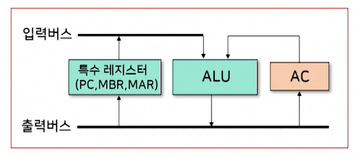
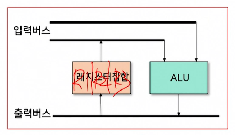
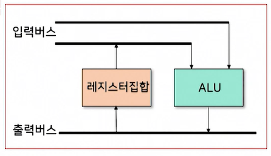
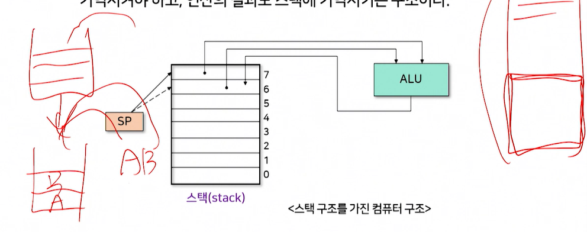
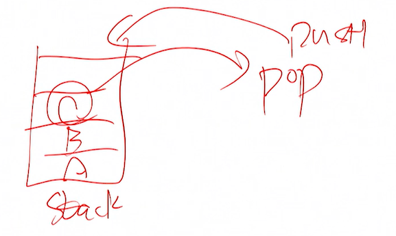

# 컴퓨터의 구성

### ◆ 하드웨어
    - 중앙처리장치 (CPU)
    - 기억장치 (주기억장치, 보조기억장치)
    - 입출력장치
    - 시스템 버스 : 데이터 및 명령 제어 신호를 장치로 실어나름

1. 기억장치
    - 주기억장치 : 실행중인 프로그램에서의 데이터를 일시적으로 저장. 프로그램 종료 시 소멸 
    ex> RAM
    - 보조기억장치 : 전원이 꺼져도 데이터를 영구적으로 보관 가능 
    ex> 하드디스크

2. 입출력장치
    - I/O 장치

3. 시스템버스
    - 데이터 버스 : 중앙처리장치 <─> 기억장치, 입출력장치 (양방향) 
    명령어 및 데이터를 주고받음
    - 주소 버스 : 중앙처리장치 ─> 입출력장치 (단방향) 
    데이터를 보내기 위해 기억장치 주소를 전달
    - 제어 버스 : 중앙처리장치 <─> 기억장치, 입출력장치 (양방향) 
    제어 신호를 주고받음. 모든 장치에 공유. 읽기/쓰기 동작 모두 수행. 
 

### ◆ 소프트웨어
    - 운영체제, 컴파일러, 소프트웨어 등
 
 

# 중앙처리장치(CPU) 작동 원리

### ◆ CPU 구성
    1. 연산장치 : 산술/논리 연산 수행.
        - 연산에 필요한 데이터를 레지스터에서 가져옴.
        - 연산 결과를 보냄.
    2. 제어장치 : 명령어를 순서대로 실행할 수 있도록 제어.
        - 주기억장치에서 명령어를 불러와 해석.
        - 명령어 실행에 필요한 제어 신호를 기억/연산/입출력 장치에 보냄.
        - 실행시키는 것이 아니라, 실행 순서를 결정.
    3. 레지스터 : 연산 데이터나 결과를 임시 저장.
        - 고속기억장치.
        - 용량 적음.
        - 휘발성이다.
 

### ◆ CPU 동작과정
1. 주기억장치에서 데이터나 프로그램을 읽어옴.
    - 입출력장치에서 입력받은 데이터
    - 보조기억장치에 저장된 프로그램
2. 프로그램을 실행하기 위한 준비.
    - 주기억장치에 저장된 프로그램 명령어 및 데이터를 READ
    - 처리 결과를 주기억장치에 다시 SAVE
3. 주기억장치는 처리 결과를 다시 보조기억장치에 저장하거나 출력장치로 보냄.
4. 제어장치가 신호를 전달하면서 순서 결정. 
 
 

# 명령어 Cycle

누산기(AC)라는 특별한 레지스터 
- 2개의 구분으로 이루어진다 
- 연산 종류 코드그룹: 연산자 
- 연산 대상 데이터: 피연산자) 
 
덧셈 10, 20 
ADD 10, 20 
 
 

### 1. 기억 장소에 따른 명령어 형식

### 1-1) 
    ▶ ADD X ; AC <- AC + Memory[X]
    
    누산기(AC)에 있는 내용과 기억장치 X번지에 있는 내용을 더해서 누산기(AC)로 전송하라

    ▶ LOAD X ; AC <- M[X]

    기억장치 X번지에 있는 내용을 누산기로 적재하라

    ▶ STORE X ; M[X] <- AC

    누산기의 내용을 기억장치 X번지에 저장하라
 

### 1-2) 다중 레지스터를 이용하는 명령어 형식
 

    ▶ ADD R1, R2, R3 ; R3 <- R1 + R2

    레지스터 R1의 내용과 레지스터 R2의 내용을 더해서 레지스터 R3로 전송하라

    - R1, R2 출발 레지스터
    - R3 도착 레지스터

    ※ 왼쪽에서 오른쪽으로 연산 진행 (약속임)

    ▶ ADD R1, R2 ; R2 <- R1 + R2

    레지스터 R1의 내용과 레지스터 R2의 내용을 더해서 레지스터 R2로 전송하라

    - R2 출발 레지스터 or 도착 레지스터
    - R1 출발 레지스터

### 1-2-A) 전달기능을 가진 명령어

    ▶ Move R1, R1 ; R1 <- R1

    레지스터 R1의 내용을 레지스터 R2로 전송하라

### 1-2-B) 주소필드 중 하나가 기억장치 주소필드인 경우

    ▶ LOAD X, R1 ; R1 <- M[X]

    기억장치 X번지의 내용을 레지스터 R1에 적재하라

    ▶ STORE R1, X ; M[X] <- R1

    레지스터 R1의 내용을 기억장치 X번지에 저장하라

### 1-3) 스택구조를 이용하는 명령어 형식 (후입선출)
 
- 스택구조 컴퓨터는 연산에 필요한 피연산자들을 기억장치 스택에 기억시켜야 함
- 연산의 결과도 스택에 기억시키는 구조
- 디폴트는 랜덤 access구조

### ◆ 주소 필드 사용 안함

    ▶ ADD ; TOS <- TOS + TOS -1

    기억장치 스택의 맨 위(TOS)의 내용과 그 아래(TOS -1)의 내용을 더해서 스택의 맨 위(TOS: Top Of Stack)로 전송하라

### ◆ 주소 필드 사용

    ▶ PUSH X ; TOS <- M[X]

    기억장치 주소 X의 내용을 기억장치 스택의 맨 위(TOS)로 전송하라

    ▶ POP X ; M[X] <- TOS

    기억장치 스택의 맨 위(TOS)의 내용과 그 아래(TOS -1)의 내용을 더해서 스택의 맨 위(TOS: Top Of Stack)로 전송하라

 
 

### 2. 주소지정방식

    연산코드 | 주소지정방식(Mode) | 주소 혹은 오퍼랜드(피연산자)

    1) 연산코드
    - 연산종류
    ex> ADD

    2) 주소지정방식 필드
    - 연산에 필요한 오퍼랜드의 주소를 알아내는데 사용

    3) 주소 혹은 오퍼랜드 필드
    - 기억장치주소 혹은 레지스터를 나타냄
 
 

# 캐시 메모리(Cache Memory)

 
 

# 고정 소수점 & 부동 소수점
