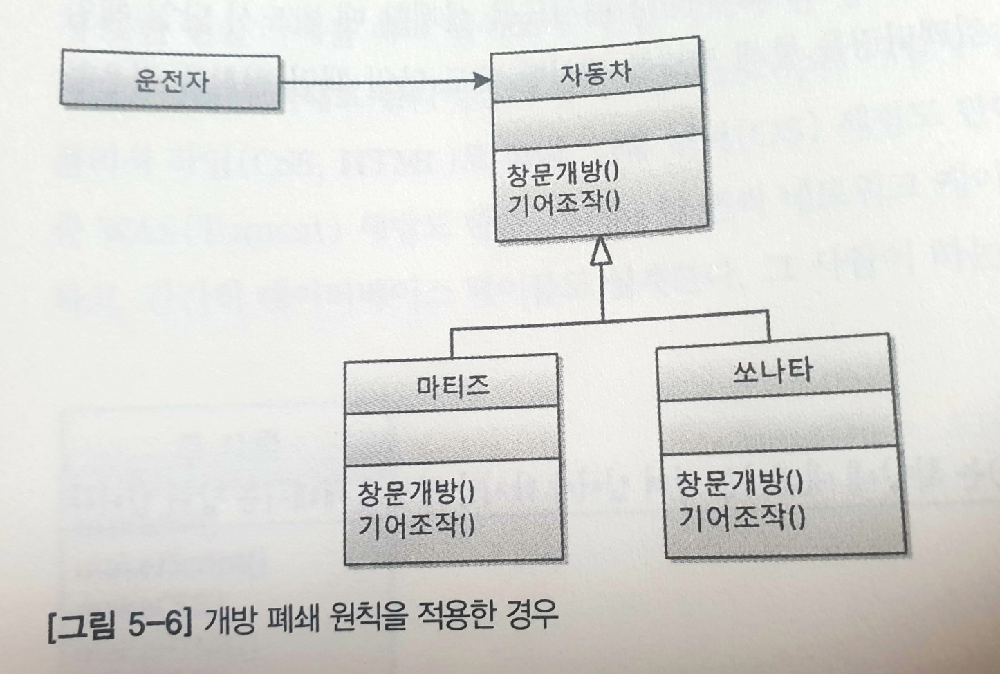
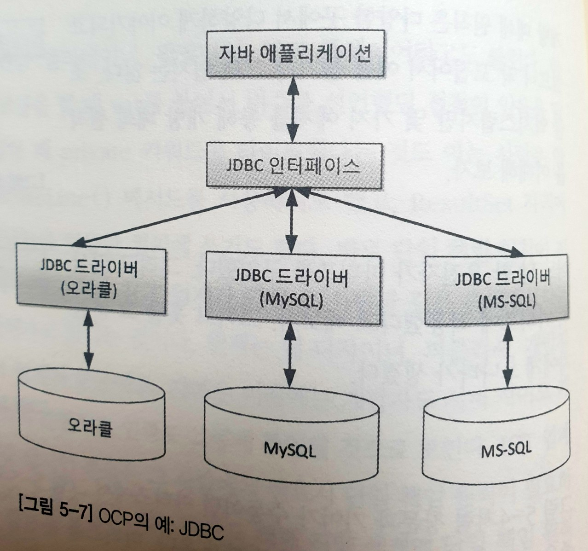
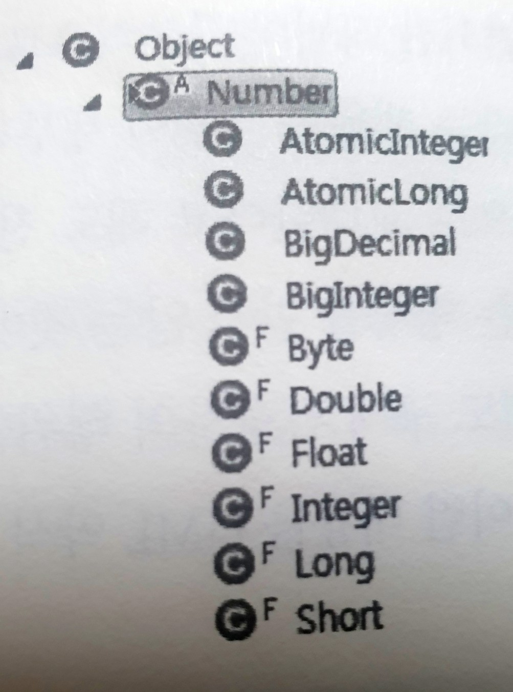
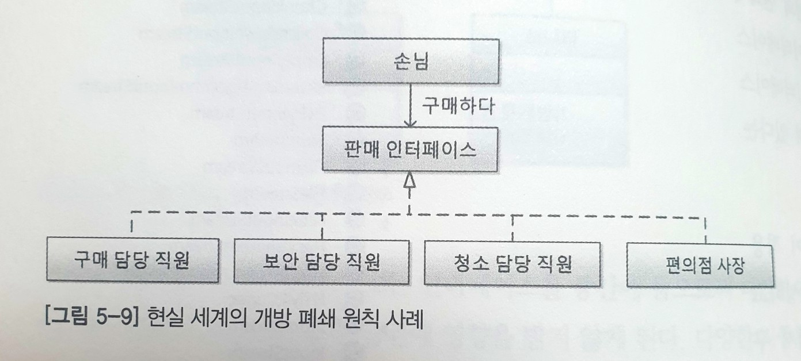
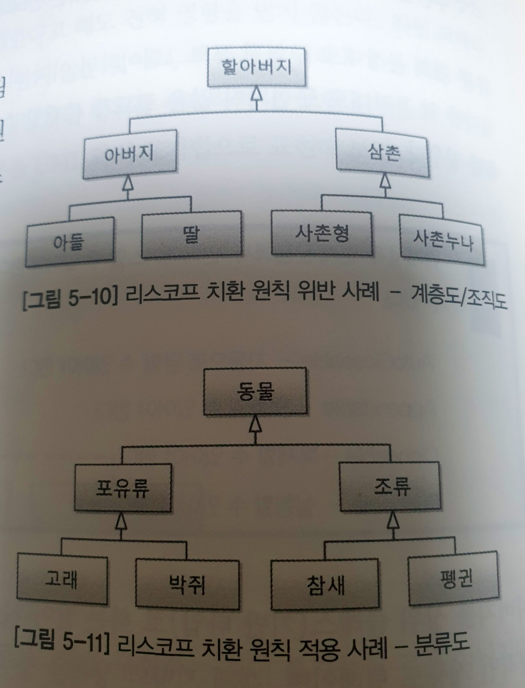
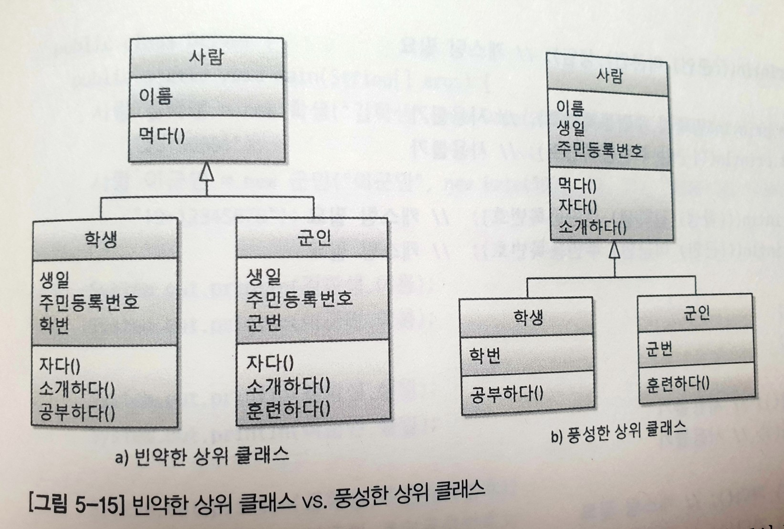
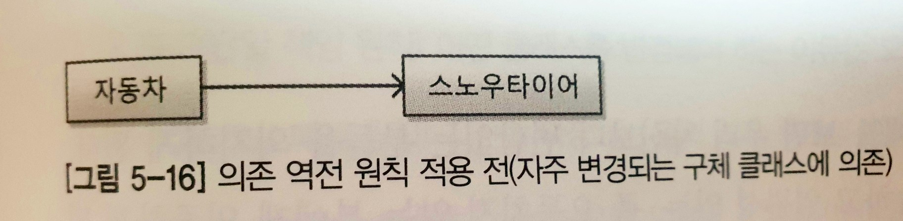
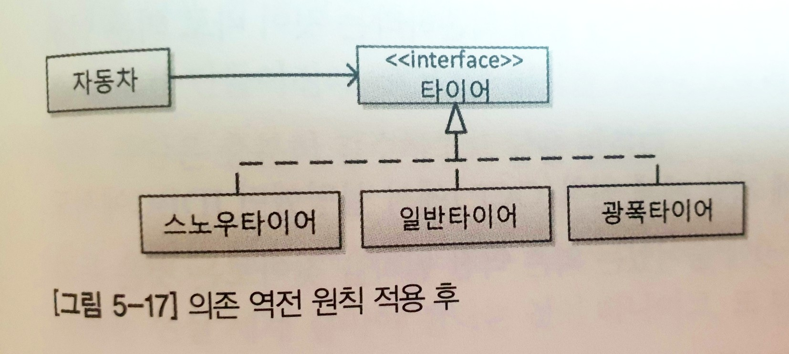

# SOLID

## Single Responsibility Principle 단일 책임<br/>
    - 클래스는 오직 하나의 이유로 변경되어야 한다.
### 지키지 않은 경우
 - Animal 클래스가 human 과 dog 둘 다 walk 를 책임지고 있다.
```java
// Java
public class Animal {
    final static int human = 2;
    final static int dog = 4;
    Boolean legs;

    void walk() {
        if(this.legs == human) {
            // Human 은 다리 2개를 써서 걷는다.
        } else {
            // Dog 는 다리 4개를 써서 걷는다.
        }
    }
}
```
### 지킨 경우
 - Animal 클래스를 상속 받은 Human 과 Dog 각각 walk 를 책임지고 있다.
```java
// Java
abstract class Animal {
    abstract void walk();
}
public class Human extends Animal {
    void walk() {
        // Human 은 다리 2개를 써서 걷는다.
    }
}
public class Dog extends Animal {
    void walk() {
        // Dog 는 다리 4개를 써서 걷는다.
    }
}
```   
<br/><br/>

## Open Closed Principle 개방 폐쇄
    - 확장에는 open 변경에는 closed
- 데이터 객체<br/>
<br/>
- 애플리케이션 라이브러리 구조<br/>
<br/>
- 자바 패키지 구조<br/>
<br/>
- 인터페이스<br/>
<br/>
<br/><br/>

## Liskov Substitution Principle 리스코프 치환
    - base 클래스에서 파생된 클래스는 base 클래스를 대체해서 사용할 수 있어야한다.
1. (주체) 하위 클래스는 상위 클래스의 종류여야한다.
2. (행위) 구현 클래스는 인터페이스(ex: 주문 기능)할 수 있어야한다.

※ 객체 지향의 상속은 계층도가 아닌, 분류도처럼 되어야한다.
<br/><br/>
ex ><br/>
- 계층도 : 조직<br/>
- 분류도 : 생태계<br/>
<br/>
※ 상위 클래스는 추상적, 포함 관계여야한다는 의미로 이해.<br/>
<br/><br/>

## Interface Segregation Principle 인터페이스 분리
- 예시1
```
                      ┌──────(Friend)────── Friend
                      │
Dog ─────(Owner)───── Me ────(Employee)──── Company
                      │
Mother ──(Daughter)───┘
```
- 예시2
<br/>
<br/>

### !!! 아래 문제점, 차이점 부분은 개인적인 생각입니다 !!!
문제점<br/>
1. 중복 - 추상화 x<br/>
2. 불필요한 형변환 - 상속의 의미 X<br/>
<br/>

리스코프와 인터페이스 분리의 차이점<br/>
- 리스코프 (추상화에 촛점) : 어떤 공통점으로 묶을까 
- 인터페이스 분리 (분리에 촛점) : 어느 부분으로 나눌까
<br/><br/>

## Dependency Inversion Principle 의존 역전
- 적용 전<br/>
<br/>
스노우타이어가 그 무엇에도 의존하지 않는 클래스였고 자동차가 스노우타이어에 의존하고 있는 상태.<br/>
<br/>
- 적용 후<br/>
<br/>
스노우타이어가 추상적인 것인 타이어 인터페이스에 의존.<br/>
<br/>
※ 의존의 방향이 역전 되었다!!!<br/>
<br/>
자신보다 변하기 쉬운 것에 의존하던 것을<br/>
추상화된 인터페이스나 상위 클래스를 두어<br/>
변하기 쉬운 것의 변화에 영향받지 않게 하는 방법<br/>
즉, 의존성을 약하게 만들어서 유지보수를 용이하게 하기 위함이다.<br/>
<br/>
또다른 예시
 - 할인 쿠폰