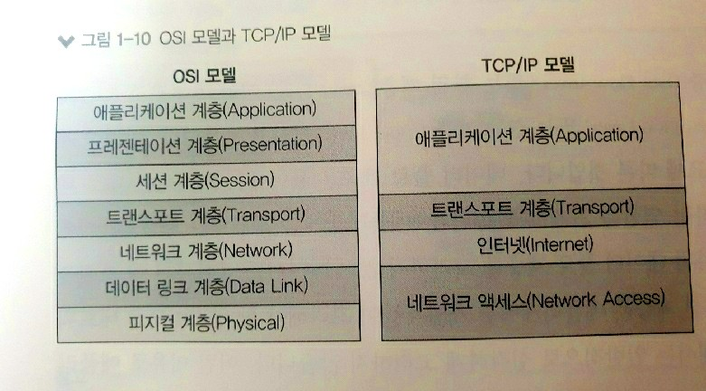

# 용어

### 프로토콜
- 통신규약
- 물리적 : 이더넷, 랜선 등
- 논리적 : TCP/IP, SMTP 등
  

### 각 계층별 전송 기술

- 5~7계층 : 애플리케이션 계층
- 4계층 : 전송 계층, 프로세스를 구분
- 3계층 : 네트워크 계층(인터넷), 호스트(컴퓨터)를 구분
- 1~2계층 : 피지컬/데이터 링크(네트워크 액세스) 계층, 노드를 구분
  

### 1계층 (피지컬)
<pre>전기 신호 전달</pre>
- 허브, 리피터 : 네트워크 통신을 중재하는 네트워크 장비
- 케이블, 커넥터 : 케이블 본체 구성 요소
- 트랜시버 : 컴퓨터 랜카드와 케이블 연결 장비
- 탭 : 네트워크 모니터링과 패킷 분석을 위해 전기 신호를 다른 장비로 복제

### 2계층(데이터 링크)
<pre>...</pre>

각 구분과의 전송 기술
<pre>- 2계층 : 노드를 구분
- 3계층 : 호스트(컴퓨터)를 구분
- 4계층 : 프로세스를 구분</pre>

4계층 : 전송 계층(Transport Layer)
<pre>- 내가 실행 중인 프로그램을 전세계에서 유일하도록 식별 가능.
- 프로세스를 고유하게 식별하기 위해서는 포트 번호가 필요.
- 특별하게 예약된 변호들로 HTTP는 80, HTTPS는 443.
- IP와 Port 를 합쳐서 Socket Address 라고 부른다.</pre>

이중통신
<pre>- 전이중(Full Duplex) : 전화
- 반이중(Half Duplex) : 무전기
- 단방향 통신(Simplex) : 텔레비전</pre>

MAC Address
<pre>- 네트워크 장비에 이미 고정되어 있는 주소이고 유일한 주소</pre>

프레임(Frame)
<pre>- 패킷을 목적지로 전달하기 위해 MAC 주소를 포함한 헤더가 붙은 형태.
- 2계층에서 만들어짐</pre>

패킷(Packet)
<pre>- 세그먼트를 목적지로 전달하기 위해 IP 주소를 포함한 헤더가 붙은 형태.
- 3계층에서 만들어짐</pre>

세그먼트(Segment)
<pre>- 데이터를 적절한 크기로 분할한 덩어리.
- 4계층에서 만들어짐</pre>
 
 

# TCP/UDP 차이, 장단점, 용도, 예시

## TCP (Transmission Control Protocol)
<pre>전송 제어 프로토콜(규약)</pre>
- 인터넷에서 데이터를 메시지의 형태로 보내기 위해 IP와 함께 사용하는 프로토콜
- 데이터를 패킷 단위로 나누어서 목적지(IP계층)로 보낸다.
- 이때, 각 패킷에 번호를 붙여서 순서대로 도착하지 못했을 경우 다시 재조립하여 보낸다.
- 그래서 느리다.
- 연결 지향 방식이고, 전이중 방식이다.
- 데이터를 보내기 전에 연결 설정 단계를 거치고 보낸 후에는 연결 종료 단계를 거쳐야 한다.
- 그러므로 패킷을 추적 및 관리가 가능하다.
- 패킷을 정확하게 전송하기 위해서 3way-handshaking 과정을 거친다.
- 연결을 해제할 때는 4way-handshaking 과정을 거친다.
- 이것은 신뢰성을 보장하는 연결성 서비스의 하나이다.
  

### TCP 서버
- 서버소켓은 연결만을 담당한다.
- 서버와 클라이언트 1대1로 연결된다.
- 스트림 전송으로 전송 데이터의 크기가 무제한이다.
- 패킷에 대한 응답을 해야하기 때문에 성능이 낮다.
- 느리고, CPU 소모가 크다.
- 재전송 요청을 하게 되기 때문에 스트리밍 서비스에 불리하다.

### TCP 의 예시
- 텍스트(카카오톡 메시지, 웹페이지 내용 등) 전송
  

## UDP (User Datagram Protocol)
<pre>데이터그램 프로토콜(규약)</pre>
- 데이터를 데이터그램 단위로 처리하는 프로토콜
- 비연결형 프로토콜이다.
- 연결을 위해 할당되는 논리적인 경로가 없어서 각각 다른 경로로 전송이 된다.
- 각각의 패킷은 독립적인 관계이다.
- 송수신 신호절차를 거치지 않는다.
- UDP 헤더의 CheckSum 필드를 통해 최소한의 오류만 검출한다.
- 흐름 제어나 혼잡 제어와 같은 처리를 하지 않는다.
- 그래서 신뢰성이 낮다.
- 그러나 TCP보다 속도가 빠르다.
<pre>흐름 제어란,
데이터를 송신하는 곳에서 수신하는 곳에 과하게 보내서 문제가 발생하지 않도록 데이터 처리 속도를 조절하는 것을 말한다.</pre>
<pre>혼잡 제어란,
패킷 수가 넘치지 않게 방지하는 것을 말한다.</pre>

### UDP 서버
- UDP에는 연결 자체가 없어서(connect 함수 불필요) 서버 소켓과 클라이언트 소켓의 구분이 없다.
- 소켓 대신 IP를 기반으로 데이터를 전송한다.
- 서버와 클라이언트는 1대1, 1대N, N대M 등으로 연결 가능하다.
- 파일 전송과 같은 신뢰성이 필요한 서비스보다 성능이 중요시 되는 경우에 사용된다.

### UDP 의 예시
- 멀티미디어(이미지, 사운드, 동영상 등) 전송, 온라인 게임 
   -> 이해가 안된다면 동영상 품질 생각 하면 된다.
  

# Reference
https://sharpcoder.tistory.com/entry/TCP-vs-UDP 
https://wormwlrm.github.io/2021/09/23/Overview-of-TCP-and-UDP.html
https://sharpcoder.tistory.com/entry/TCP-vs-UDP
https://sites.google.com/site/21herecomeputer/2-2
https://mangkyu.tistory.com/15
