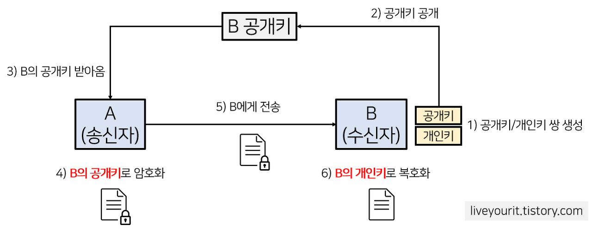

# OSI 7계층

OSI(Open Systems Interconnection)
컴퓨터 네트워크 아키텍처를 이해하고 설계하기 위한 개념적 프레임워크.
네트워크 통신을 각각 특정 기능을 수행하는 7개의 추상 계층으로 나누는 계층화된 접근 방식.
  

1. 물리적 계층
     - 케이블, 커넥터 및 신호 전송 속도와 같은 연결의 물리적 특성을 포함
     - 통신 채널을 통한 원시 비트 전송
2. 데이터 링크 계층
     - 오류를 감지 및 수정하고 데이터 흐름을 관리
     - 물리적 연결을 통해 안정적인 데이터 전송을 제공
---
3. 네트워크 계층
     - 서로 다른 네트워크 간의 논리적 주소 지정 및 데이터 라우팅을 담당
     - <pre>라우팅이란
       - 데이터가 컴퓨터 네트워크에서 소스에서 목적지로 이동할 수 있는 최상의 경로를 선택하는 프로세스.
       - 네트워크의 장치가 다른 장치로 데이터를 보내려고 할 때 기본 게이트웨이(라우터)로 데이터를 보낸 다음 대상 경로의 다음 네트워크 세그먼트로 데이터를 전달.</pre>
---
4. 전송 계층 - 데이터 흐름을 관리하고 데이터가 오류 없이 올바른 순서로 전달되도록 보장하여 단말기(endpoint) 간 안정적인 데이터 전송을 제공
---
5. 세션 계층 - 네트워크 장치 간의 통신 세션 설정, 유지 및 종료를 관리
6. 프리젠테이션 계층 - 일관되고 이해하기 쉬운 형식으로 표시되도록 데이터의 형식 지정, 암호화 및 압축을 담당
7. 애플리케이션 계층 - 최종 사용자 애플리케이션이 네트워크를 통해 데이터를 교환하는 데 사용하는 서비스 및 프로토콜을 제공
    

# 대칭키와 비대칭키

대칭 키 암호화
- 데이터의 암호화 및 암호 해독에 <strong>동일한 비밀 키</strong>를 사용
- 발신자와 수신자는 <strong>복호화</strong>에 사용되는 <strong>동일한 비밀 키</strong>를 가짐
<pre>장점
빠르고 효율적</pre>
<pre>단점
동일한 키를 발신자와 수신자 간에 공유하기에 보안상 위험</pre>
 

공개 키 암호화 (=비대칭 키 암호화)

- 암호화 및 암호 해독에 수학적으로 관련된 두 개의 키를 사용
- <strong>공개 키는 공개</strong>하여 공유 (=Public Key)
    - 데이터 <strong>암호화</strong>를 하는 데에 사용
- <strong>개인 키는 비공개</strong>로 소유자만 유지 (=Secret Key)
    - 데이터를 <strong>복호화</strong>하는 데 사용
- 개인 키는 누구에게도 공유되거나 공개되지 않기 때문에 대칭 키 암호화보다 더 강력한 보안을 제공
- 일반적으로 보안 키 교환 및 디지털 서명에 사용

<pre>장점
암호화 및 암호 복호화에 서로 다른 키를 사용하기 때문에 더 안전</pre>
<pre>단점
느리고 덜 효율적</pre>
   

## TCP 3 way handshake & 4 way handshake

<pre>TCP(전송 제어 프로토콜)
네트워크를 통해 데이터를 안정적이고 순서대로 전송하는 데 사용되는 통신 프로토콜</pre>

- 3 way handshake
- TCP의 초기 연결 설정 프로세스로, 양쪽 끝이 통신할 준비가 되었는지 확인한다.
---
1. 클라이언트는 서버에 SYN(Synchronize, 동기화) 패킷을 전송하여 연결을 설정하려고 요청을 보낸다.
2. 서버는 SYN-ACK(Synchronize-Acknowledge) 패킷으로 응답하여 클라이언트의 요청을 받았고 연결을 설정할 의향이 있음을 알린다.
3. 클라이언트는 ACK(Acknowledge) 패킷으로 응답하여 서버의 응답을 받았고 통신을 시작할 준비가 되었음을 확인한다.
---
완료되면 클라이언트와 서버 간에 데이터를 전송할 수 있다.
---
---

- 4 way handshake
- TCP 연결을 종료하는 데 사용되는 프로세스.
---
1. 클라이언트는 FIN(Finish) 패킷을 서버로 보내 연결을 종료할 것임을 알린다.
2. 서버는 ACK 패킷으로 응답하여 클라이언트의 요청을 수신했음을 확인한다.
3. 서버는 FIN 패킷을 클라이언트에 전송하여 연결을 종료할 것임을 알린다.
4. 클라이언트는 ACK 패킷으로 응답하여 서버의 요청을 수신했음을 확인하고 연결을 종료한다.
---
- 4 way handshake
- 양 끝이 데이터 전송을 완료하고 연결을 닫을 준비가 되었는지 확인합니다.
   

## Flow Control & Congestion control

데이터 흐름을 관리하고 네트워크 혼잡을 방지하기 위해 컴퓨터 네트워크에서 사용되는 두 가지 기술
  

### ■ 흐름 제어

- 수신자의 데이터가 넘쳐버리는 것을 방지하기 위해 발신자와 수신자 간의 데이터 흐름을 조절하는 데 사용되는 기술
- 수신자는 수신할 수 있는 데이터의 양을 나타내는 승인을 보내고 송신자는 수신자의 승인에 따라 보내는 데이터의 양을 조정하는 슬라이딩 윈도우 프로토콜을 사용
<pre>슬라이딩 윈도우 프로토콜
두 호스트 간 데이터 전송을 위한 일반적인 통신 프로토콜</pre>
- 장점
    - 수신기의 데이터 범람을 방지
    - 안정적인 데이터 전송을 보장
- 단점
    - 데이터 전송 속도 저하
    - 대기 시간 증가
  

### ■ 혼잡 제어

- 데이터가 전송되는 속도를 조절하여 네트워크 혼잡을 방지하는 데 사용되는 기술
- 전송 속도를 줄이는 패킷 드롭, 대기열 및 제한과 같은 기술을 사용
- 장점
    - 네트워크 혼잡을 방지
    - 네트워크 리소스의 공정한 사용을 보장
- 단점
    - 데이터 전송 속도 저하
    - 대기 시간 증가
  

### ■ 흐름제어와 혼잡제어의 차이

- 흐름 제어
    - 발신자와 수신자 간의 데이터 흐름을 규제
    - 수신자가 과도한 데이터를 수신하지 않도록 방지
- 혼잡 제어
    - 네트워크를 통한 데이터 전송 속도를 규제
    - 네트워크 혼잡을 방지
 
 
 
 

### ETC
- TCP와 UDP는 지난 번에 해서 PASS
- 컴퓨터 구조 2문제
    - Q1. ARM 프로세서
    - Q2. 고정 소수점 & 부동 소수점

### Image Reference
- https://liveyourit.tistory.com/183